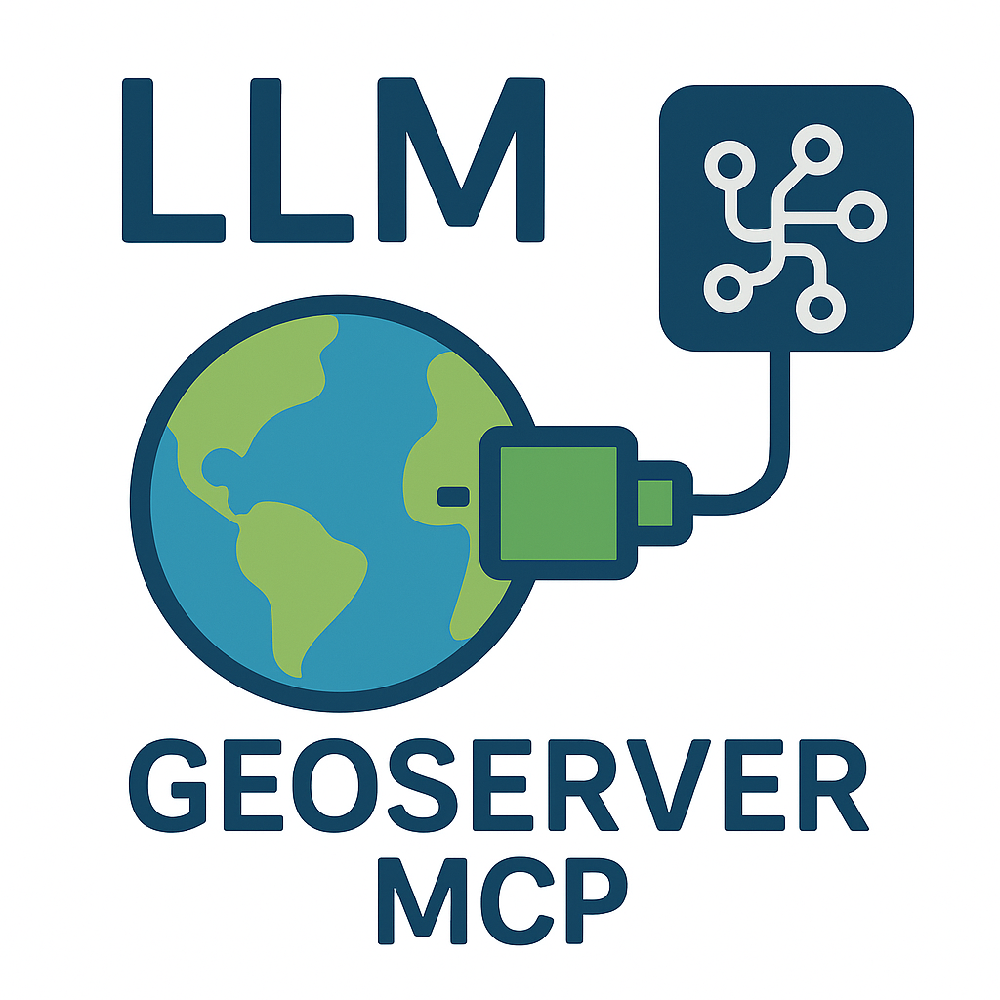

# GeoServer MCP Server

<a href="https://badge.mcpx.dev?type=server 'MCP Server'">
    
</a>
<p align="center">
  A Model Context Protocol (MCP) server implementation that connects Large Language Models (LLMs) to the GeoServer REST API, enabling AI assistants to interact with geospatial data and services.
</p>

<div align="center">
  
</div>

## 🏆 Badges & Indexes

<div align="center">
  <a href="https://glama.ai/mcp/servers/@mahdin75/geoserver-mcp">
    
  </a>
  <br/><br/><br/>
  <a href="https://mcp.so/server/Geoserver%20MCP%20Server/mahdin75">
    
  </a>
</div>

## 📋 Table of Contents

- [Features](#-features)
- [Prerequisites](#-prerequisites)
- [Installation](#️-installation)
- [Configuration](#-configuration)
- [Available Tools](#️-available-tools)
- [Example Usage](#-example-usage)
- [Planned Features](#-planned-features)
- [Contributing](#-contributing)
- [License](#-license)
- [Related Projects](#-related-projects)
- [Support](#-support)

## 🚀 Features

- 🔍 Query and manipulate GeoServer workspaces, layers, and styles
- 🗺️ Execute spatial queries on vector data
- 🎨 Generate map visualizations
- 🌐 Access OGC-compliant web services (WMS, WFS)
- 🔄 Real-time interaction with GeoServer REST API
- 📊 Support for complex spatial operations
- 🛠️ Easy integration with MCP-compatible clients

## 📋 Prerequisites

- Python 3.10 or higher
- Running GeoServer instance with REST API enabled
- MCP-compatible client (like Claude Desktop or Cursor)
- `geoserver-rest` package
- Internet connection for package installation

## 🛠️ Installation

1. Clone the repository:

```bash
git clone https://github.com/mahdin75/geoserver-mcp.git
cd geoserver-mcp
```

2. Install the package:

```bash
pip install -e .
```

3. Configure GeoServer connection:

**Linux/Mac:**

```bash
export GEOSERVER_URL="http://localhost:8080/geoserver"
export GEOSERVER_USER="admin"
export GEOSERVER_PASSWORD="geoserver"
```

**Windows PowerShell:**

```powershell
$env:GEOSERVER_URL="http://localhost:8080/geoserver"
$env:GEOSERVER_USER="admin"
$env:GEOSERVER_PASSWORD="geoserver"
```

4. Start the server:

```bash
geoserver-mcp-server
```

## 🔧 Configuration

### Command-line Arguments

```bash
geoserver-mcp-server --url http://localhost:8080/geoserver --user admin --password geoserver --debug
```

### Environment Variables

| Variable           | Description            | Default                         |
| ------------------ | ---------------------- | ------------------------------- |
| GEOSERVER_URL      | GeoServer instance URL | http://localhost:8080/geoserver |
| GEOSERVER_USER     | Admin username         | admin                           |
| GEOSERVER_PASSWORD | Admin password         | geoserver                       |

### MCP Client Integration

#### Claude Desktop

Edit `claude_desktop_config.json`:

```json
{
  "mcpServers": {
    "geoserver-mcp-server": {
      "command": "geoserver-mcp-server",
      "args": [
        "--url",
        "http://localhost:8080/geoserver",
        "--user",
        "admin",
        "--password",
        "geoserver"
      ]
    }
  }
}
```

#### Cursor

Create `.cursor/mcp.json`:

```json
{
  "mcpServers": {
    "geoserver-mcp-server": {
      "command": "geoserver-mcp-server",
      "args": [
        "--url",
        "http://localhost:8080/geoserver",
        "--user",
        "admin",
        "--password",
        "geoserver"
      ]
    }
  }
}
```

## 🛠️ Available Tools

### Catalog Management

| Tool               | Description                 |
| ------------------ | --------------------------- |
| `list_workspaces`  | Get available workspaces    |
| `create_workspace` | Create a new workspace      |
| `get_layer_info`   | Get detailed layer metadata |
| `list_layers`      | List layers in a workspace  |
| `create_layer`     | Create a new layer          |
| `delete_resource`  | Remove resources            |

### Data Operations

| Tool              | Description                        |
| ----------------- | ---------------------------------- |
| `query_features`  | Execute CQL queries on vector data |
| `update_features` | Modify feature attributes          |
| `delete_features` | Remove features based on criteria  |

### Visualization

| Tool           | Description                     |
| -------------- | ------------------------------- |
| `generate_map` | Create styled map images        |
| `create_style` | Define new SLD styles           |
| `apply_style`  | Apply existing styles to layers |

## 📚 Example Usage

### List Workspaces

```
Tool: list_workspaces
Parameters: {}
Response: ["default", "demo", "topp", "tiger", "sf"]
```


### Get Layer Information

```
Tool: get_layer_info
Parameters: {
  "workspace": "topp",
  "layer": "states"
}
```

### Query Features

```
Tool: query_features
Parameters: {
  "workspace": "topp",
  "layer": "states",
  "filter": "PERSONS > 10000000",
  "properties": ["STATE_NAME", "PERSONS"]
}
```

### Generate Map

```
Tool: generate_map
Parameters: {
  "layers": ["topp:states"],
  "styles": ["population"],
  "bbox": [-124.73, 24.96, -66.97, 49.37],
  "width": 800,
  "height": 600,
  "format": "png"
}
```

## 🔮 Planned Features

- [ ] Add Dockerfile
- [ ] Coverage and raster data management
- [ ] Security and access control
- [ ] Advanced styling capabilities
- [ ] WPS processing operations
- [ ] GeoWebCache integration
- [ ] Batch operations support
- [ ] Performance optimizations
- [ ] Extended query capabilities

## 🤝 Contributing

We welcome contributions! Here's how you can help:

1. Fork the repository
2. Create a feature branch (`git checkout -b feature/AmazingFeature`)
3. Commit your changes (`git commit -m 'Add some AmazingFeature'`)
4. Push to the branch (`git push origin feature/AmazingFeature`)
5. Open a Pull Request

Please ensure your PR description clearly describes the problem and solution. Include the relevant issue number if applicable.

## 📄 License

This project is licensed under the MIT License - see the [LICENSE](LICENSE) file for details.

## 🔗 Related Projects

- [Model Context Protocol](https://github.com/modelcontextprotocol/python-sdk) - The core MCP implementation
- [GeoServer REST API](https://docs.geoserver.org/latest/en/user/rest/index.html) - Official GeoServer REST documentation
- [GeoServer REST Python Client](https://github.com/gicait/geoserver-rest) - Python client for GeoServer REST API

## 📞 Support

For support, please Open an [issue](https://github.com/mahdin75/geoserver-mcp/issues)
