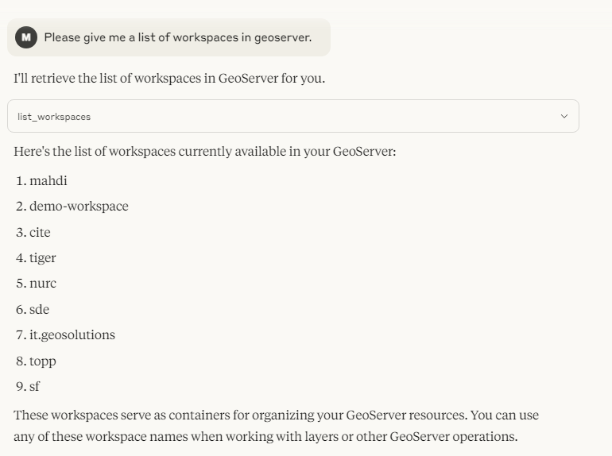

# GeoServer MCP Server

<div align="center">
  
</div>

A Model Context Protocol (MCP) server implementation that connects Large Language Models (LLMs) to the GeoServer REST API, enabling AI assistants to interact with geospatial data and services.

## 🚀 Features

- 🔍 Query and manipulate GeoServer workspaces, layers, and styles
- 🗺️ Execute spatial queries on vector data
- 🎨 Generate map visualizations
- 🌐 Access OGC-compliant web services (WMS, WFS)

## 📋 Prerequisites

- Python 3.10+
- Running GeoServer instance with REST API enabled
- MCP-compatible client (like Claude Desktop)
- `geoserver-rest` package

## 🛠️ Installation

1. Install the package:

```bash
pip install -e .
```

2. Configure GeoServer connection:

**Linux/Mac:**

```bash
export GEOSERVER_URL="http://localhost:8080/geoserver"
export GEOSERVER_USER="admin"
export GEOSERVER_PASSWORD="geoserver"
```

**Windows PowerShell:**

```powershell
$env:GEOSERVER_URL="http://localhost:8080/geoserver"
$env:GEOSERVER_USER="admin"
$env:GEOSERVER_PASSWORD="geoserver"
```

3. Start the server:

```bash
geoserver-mcp-server
```

## 🔧 Configuration

### Command-line Arguments

```bash
geoserver-mcp-server --url http://localhost:8080/geoserver --user admin --password geoserver --debug
```

### MCP Client Integration

#### Claude Desktop

Edit `claude_desktop_config.json`:

```json
"mcpServers": {
  "geoserver-mcp-server": {
    "command": "geoserver-mcp-server",
    "args": [
      "--url", "http://localhost:8080/geoserver",
      "--user", "admin",
      "--password", "geoserver"
    ]
  }
}
```

#### Cursor

Create `.cursor/mcp.json`:

```json
{
  "mcpServers": {
    "geoserver-mcp-server": {
      "command": "geoserver-mcp-server",
      "args": [
        "--url",
        "http://localhost:8080/geoserver",
        "--user",
        "admin",
        "--password",
        "geoserver"
      ]
    }
  }
}
```

## 🛠️ Available Tools

### Catalog Management

- `list_workspaces` - Get available workspaces
- `create_workspace` - Create a new workspace
- `get_layer_info` - Get detailed layer metadata
- `list_layers` - List layers in a workspace
- `create_layer` - Create a new layer
- `delete_resource` - Remove resources

### Data Operations

- `query_features` - Execute CQL queries on vector data

### Visualization

- `generate_map` - Create styled map images
- `create_style` - Define new SLD styles

## 📚 Example Usage

### List Workspaces

```json
Tool: list_workspaces
Parameters: {}
Response: ["default", "demo", "topp", "tiger", "sf"]
```

Here's how the workspaces appear in the MCP client:



The screenshot shows the actual workspaces available in the GeoServer instance, including: mahdi, demo-workspace, cite, tiger, nurc, sde, it.geosolutions, topp, and sf. These workspaces serve as containers for organizing your GeoServer resources.

### Get Layer Information

```json
Tool: get_layer_info
Parameters: {
  "workspace": "topp",
  "layer": "states"
}
```

### Query Features

```json
Tool: query_features
Parameters: {
  "workspace": "topp",
  "layer": "states",
  "filter": "PERSONS > 10000000",
  "properties": ["STATE_NAME", "PERSONS"]
}
```

### Generate Map

```json
Tool: generate_map
Parameters: {
  "layers": ["topp:states"],
  "styles": ["population"],
  "bbox": [-124.73, 24.96, -66.97, 49.37],
  "width": 800,
  "height": 600,
  "format": "png"
}
```

## 🔮 Planned Features

- Coverage and raster data management
- Security and access control
- Advanced styling capabilities
- WPS processing operations
- GeoWebCache integration

## 🤝 Contributing

Contributions are welcome! Please feel free to submit a Pull Request.

## 📄 License

This project is licensed under the MIT License - see the [LICENSE](LICENSE) file for details.

## 🔗 Related Projects

- [Model Context Protocol](https://github.com/modelcontextprotocol/python-sdk)
- [GeoServer REST API](https://docs.geoserver.org/latest/en/user/rest/index.html)
- [GeoServer REST Python Client](https://github.com/gicait/geoserver-rest)
